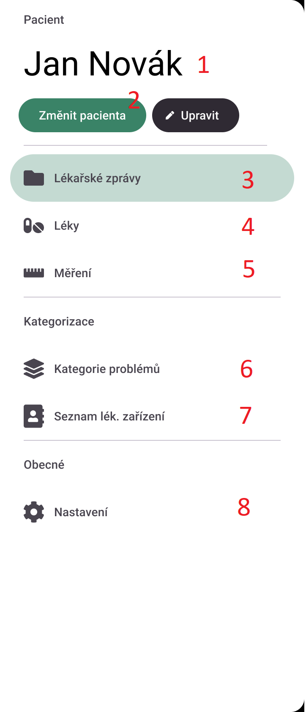
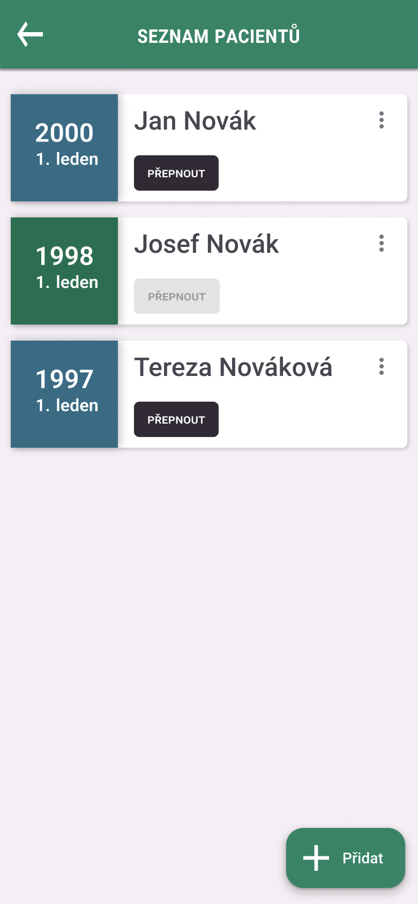

# PHR
* Autor: Vojtěch Voleman
* Kontakt: vojtech.voleman@tul.cz

## 1. O produktu
PHR je mobilní aplikace pro zařízení Android. Aplikace umožnuje správu lékařských správ - přidání, úprava, uchovávání ve skupinách. PHR nabízí možnost načtení základních informací z fotografie lékařské zprávy.

Tento produkt nabízí plnohodnotnou správu léků pacienta - od plánování, dávkování až po itinerář. Uživatel si může snadno přidávat léky, které musí užívat, a přizpůsobit si frekvenci a dávkování podle svých potřeb. Navíc, aplikace upozorní uživatele před bráním léku, aby nezapomněl svou dávku.

Dále tento produkt umožňuje uchovávat měřená data pacienta, jako jsou hmotnost, teplota, krevní tlak a další. Uživatel si může vytvořit vlastní typ měření s vlastními hodnotami a přidat k nim fotografie. S touto funkcí bude moci uživatel sledovat svůj zdravotní stav a snadno se o něj dělit se svým lékařem.

## 2. Požadavky na zařízení
- Mobilní telefon
    - \>= Android 8
    - Alespoň 50MB volného místa v uložišti
    - Nepovinné: Internetové připojení
        > Internetové připojení je využíváno pro vyhledávání léků, příbalových letáků a diagnóz. Aplikaci lze využívat i bez připojení.
    ### 2.1 Oprávnění aplikace
    - Zápis do externího uložiště: slouží pro ukládání fotografií lék. zpráv do uložiště telefonu.
    - Kamera: slouží pro vyfocení lékařské zprávy a její následné načtení

## 3. Bezpečnost aplikace
### 3.1 Uživatelská data
Veškerá vaše data jsou uložena pouze ve vašem zařízení, nikdy nejsou přenášena na naše servery

## 3. Instalace
1. Otevřete stránku aplikace v [Google Play](https://play.google.com).
2. Klikněte na tlačítko "Instalovat"
3. Po dokončení instalace aplikaci otevřete.
4. Aplikace Vás vyzve k přidání prvního pacienta a poté Vám představí uživatelské rozhraní
5. Aplikace PHR je připravena k použití.

### 4.1 Možné problémy instalace
#### 4.1.1 "Čeká na instalaci"
- Zkontrolujte, že jste připojeni k internetu. Pokud jste připojeni, zkontrolujte, že máte dostatečný počet volného místa v uložišti. Minimální požadované místo je 50MB.
#### 4.1.2 "Nelze nainstalovat"
- Zkontrolujte, zda máte dostatečný počet volného místa v uložišti. Minimální požadované místo je 50MB.
#### 4.1.3 Aplikace není v Google Play dostupná, "Nelze nainstalovat na zařízení"
- Zkontrolujte, zda máte minimálně Android 8.0.

## 5. První spuštění
Po instalaci aplikace Vás vyzve k přidání prvního pacienta. Po přidání pacienta se Vám zobrazí hlavní menu aplikace.
Popis hlavního menu:
1. Jméno aktuálně vybraného pacienta - aplikace provádí změny vždy pro aktuálně vybraného pacienta
2. "Změnit pacienta" umožňuje rychle změnit aktuálního pacienta. "Upravit" přesměruje uživatele na stránku správy pacientů.
3. "Lékařské zprávy" přesměruje uživatele na stránku správy lékařských zpráv.
4. "Léky" přesměruje uživatele na stránku správy léků.
5. "Měření" přesměruje uživatele na stránku správy měření.
6. "Kategorie problémů" přesměruje uživatele na stránku správy kategorií problémů. Každá lékařská zpráva může být přiřazena kategorie problémů.
7. "Seznam lékařů" přesměruje uživatele na stránku správy lékařů. Zde je možné vidět lékařské zprávy dle lékaře.
8. "Nastavení" přesměruje uživatele na stránku nastavení aplikace.

## 6. Správa pacientů
### 6.1 Přidání pacienta
Aplikace nabízí možnost přidání neomezeného počtu pacientů, vždy je ale vybrán pouze jeden pacient, pro kterého jsou prováděny změny. Přidání pacienta je možné provést dvěma způsoby:
#### 6.1.1 Přidání pacienta při prvním spuštění aplikace
1. Po instalaci aplikace Vás aplikace vyzve k přidání prvního pacienta. 
2. Po přidání pacienta se Vám zobrazí hlavní menu aplikace.
#### 6.1.2 Přidání pacienta přes správu pacientů.
1. V hlavním menu aplikace, pod jménem aktuálního pacienta, klikněte na tlačítko "Upravit".
2. Zobrazí se Vám seznam pacientů. Klikněte na tlačítko "Přidat".
3. Vyplňte formulář.
    - Jméno - jméno pacienta (povinné)
    - Datum narození - datum narození pacienta (nepovinné)
4. Klikněte na tlačítko "Přidat" a pacient bude přidán.

### 6.2 Úprava pacienta
Pro úpravu pacienta rozklikněte nabídku pro více akcí (tři svislé tečky) a vyberte "Upravit". Další postup je totožný s "5.1.2 Přidání pacienta přes správu pacientů".
### 6.3 Smazání pacienta
Pokud se rozhodnete pacienta smazat, můžete tak učit rozkliknutím nabídky pro více akcí (tři svislé tečky) a vybráním "Smazat". Po potvrzení smazání pacienta budou smazány všechny jeho lékařské zprávy, léky a měření. **Tato akce je nevratná**.
### 6.4 Změna aktuálního pacienta
Pro změnu aktuálního pacienta klikněte na tlačítko "Přepnout" u vámi zvoleného pacienta. Po přepnutí se tlačítko vypne a u ostatních pacientů se objeví tlačítko "Přepnout". Aktuální pacient je označen zeleným rámečkem.
## 7. Správa lékařských zpráv
### 7.1 Seznam lékařských zpráv
Na stránce "Lékařské zprávy" se zobrazují všechny lékařské zprávy aktuálně vybraného pacienta. Lékařské zprávy jsou odděleny dle aktuálně vybraného seskupování (výchozí seskupování je dle data).

Každá lékařská zpráva je tvořena boxíkem s následujícími informacemi:
- Datum - datum vytvoření lékařské zprávy
- Počet příloh - počet příloh přiřazených k lékařské zprávě (pouze pokud > 0)
- Kategorie problémů - kategorie problémů přiřazená k lékařské zprávě
- Lékař - lékař, který lékařskou zprávu vytvořil
- Kód diagnózy - kód diagnózy lékařské zprávy

Barva boxíku lékařské zprávy závisí na kategorii problémů a je upravitelná uživatelem.

### 7.2 Filtrování
Filtrování zpráv je možné ze stránky "Lékařské zprávy".
Pro filtrování klikněte na tlačítko v pravém dolním rohu obrazovky. Otevře se okénko s možnostmi filtrování. Pro provedení filtru klikněte na tlačítko "Filtrovat". Pro zrušení filtru klikněte mimo okénko.
#### 7.2.1 Seskupování
Možnost "Seskupit dle" určuje, dle čeho se budou lékařské zprávy seskupovat. Možnosti jsou:
1. "Dle datumu" - lékařské zprávy budou seskupeny dle data vydání zprávy
2. "Dle kategorie problému" - lékařské zprávy budou seskupeny dle kategorie problému
3. "Dle lékaře" - lékařské zprávy budou seskupeny dle lékaře, který zprávu vydal
#### 7.2.2 Kategorie problému
Možnost "Kategorie problému" umožňuje vypisování pouze těch zpráv, které mají přiřazenou danou kategorii problému. Ve výchozím stavu jsou zaškrtnuté všechny. Seznam je tvořen dynamicky podle kategorií, které jsou použity.
#### 7.2.3 Lékaři
Možnost "Lékaři" umožňuje vypisování pouze těch zpráv, které jsou vydány daným lékařem. Ve výchozím stavu jsou zaškrtnuti všichni lékaři. Seznam je tvořen dynamicky podle lékařů, kteří vydali lékařské zprávy.

### 7.3 Přidání lékařské zprávy
Lékařskou zprávu je možné přidat ze stránky "Lékařské zprávy".
1. Klikněte na tlačítko "Přidat" v pravém dolním rohu obrazovky.
2. V horním boxíku klikněte na tlačítko "Přidat soubor" a vyberte soubor s lékařskou zprávou.
3. Vyskočí vám dialogové okénko, ve kterém můžete zkontrolovat načtená data. Po kontrole klidněte na tlačítko "Přidat".
4. Ve formuláři doupravte chybějící informace a klikněte přidat.

## 8. Časté problémy
### 8.1 Při vyhledávání diagnóz se zobrazují jen už přidané diagnózy
Pokud se vám při vyhledávání diagnóz zobrazují jen už přidané diagnózy, je pravděpodobné, že se aplikaci nepodařilo připojit k internetu. Zkontrolujte připojení k internetu a zkuste to znovu.
### 8.2 Při přidávání lékařské zprávy se zobrazuje chyba "Nebylo možné uložit lékařskou zprávu"
Pokud se vám zobrazuje tato chyba, je pravděpodobné, že aplikace nemohla uložit vaše přílohy. Zkontrolujte, zda má aplikace povolené oprávnění pro ukládání souborů. Pokud ne, povolte oprávnění a zkuste to znovu.

## 9. Často kladené otázky
### 9.1 Jak mohu přidat nového pacienta?
Nového pacienta můžete přidat ze stránky "Pacienti". Klikněte na tlačítko "Přidat" v pravém dolním rohu obrazovky. Vyplňte formulář a klikněte na tlačítko "Přidat". Viz [6.1 Přidání pacienta](#61-přidání-pacienta).
### 9.2 Mohu pracovat s více pacienty najednou?
V současné chvíli aplikace tuto možnost nepodporuje. Pokud chcete pracovat s jiným pacientem, musíte se odhlásit a znovu přihlásit.
### 9.3 V seznamu lék. zpráv se mi nezobrazují všechny zprávy
V seznamu lékařských zpráv se zobrazují pouze zprávy, které jsou přiřazeny k aktuálnímu pacientovi. Pokud chcete zobrazit zprávy jiného pacienta, musíte se odhlásit a znovu přihlásit. Zkontrolujte také, že není zapnuto filtrování. Viz [7.2 Filtrování](#72-filtrování).
### 9.4 Jak mohu přidat novou diagnózu?
Aplikace nepodporuje přidávání vlastních diagnóz. Diagnózy v aplikaci jsou dle MKN-10 a jsou načítány z internetu. Pokud chcete seskupit zprávy, můžete využít kategorie problémů.
### 9.5 Jak mohu přidat novou kategorii problému?
Novou kategorii problému můžete přidat ze stránky "Kategorie problémů". Klikněte na tlačítko "Přidat" v pravém dolním rohu obrazovky. Vyplňte formulář a klikněte na tlačítko "Přidat". Viz [6.3 Přidání kategorie problému](#63-přidání-kategorie-problému).
### 9.6 Jaké mé osobní údaje shromažďujete?
Aplikace shromažďuje data spojená s vyhledáváním diagnóz a léků. Mimo vyhledávaný výraz uchováváme vaši IP adresu pro funkční zajištění aplikace.
