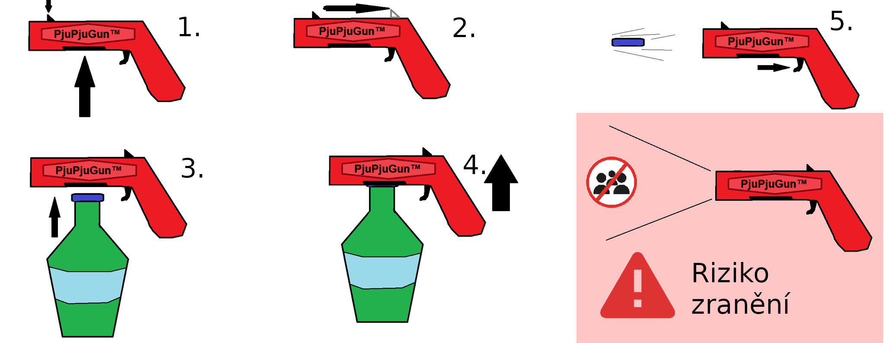

# Dokumentace pro "PjuPjuGun™"

Cílem dnešní lekce je Osvojit si otvírání skleněných lahví s PjuPjuGun™.

PjuPjuGun™ je zařízení pro otevírání zátek podtlakovaných skleněných lahví, například lahví lahodného kola loku. Funguje na bázi narušení podtlaku láhve pomocí pákového mechanismu. 
V čem se ovšem liší od své konkurence je to, že se zátkou můžete zažít spoustu krásných chvil (a výletů na pohotovost).

 

## Použití

0. Před použitím ses ujistěte, že produkt nemá viditelné poškození, a že zásobník je prázdný.
1. Natáhneme pojistku kohoutku pohybem od hlavně k rukojeti. Úspěšné natažení se projeví cvaknutím a zamezením samovolného uvolnění pružiny
2. Natažený PjuPjuGun™ přiložíme zhora na láhev tak, aby otvor v dolní části hlavně pasoval na zátku. Pokud je zátka příliš velká či malá, zvolte jiný nástroj než PjuPjuGun™. Mohlo by dojít k poškození produktu či zranění.
3. Jednou rukou podržte lahev, druhou uchopte PjuPjuGun™ za rukojeť a nakloňte směrem od sebe pomocí pákového mechanismu. Páka zdeformuje zátku, ta přestane těsnit a dojde k vyrovnání vnějšího a vnitřího tlaku vzduchu v nádobě.
4. Pokud vše proběhlo správně, víčko se uvolní od lahve a zůstane v zásobníku PjuPjuGun™
5. Před stiskem spouště se ujistěte, že hlaveň směřuje od Vás a jiných živých tvorů či křehkých předmětů - může dojít k újmě na zdraví a majetku.
6. Po ujištění stiskneme spoušť, která uvolní pružinu a tím vystřelí zátku.
    - Rychlost a vzdálenost dostřenu závisí na hmotnosti projektilu, opotřepování/natažení pružiny a povětrnostních podmínkách
7. Vystřelenou zátku již nevkládáme zpět do zásobníku a dle legislativy recyklujeme. Při nedodržení hrozí poškození produktu či újma na zdraví

## Katalogový list
- Délka: 13cm
- Výška: 6cm
- Tloušťka: 3.7cm
- Hmotnost: 50g
- Materiál: Plast

